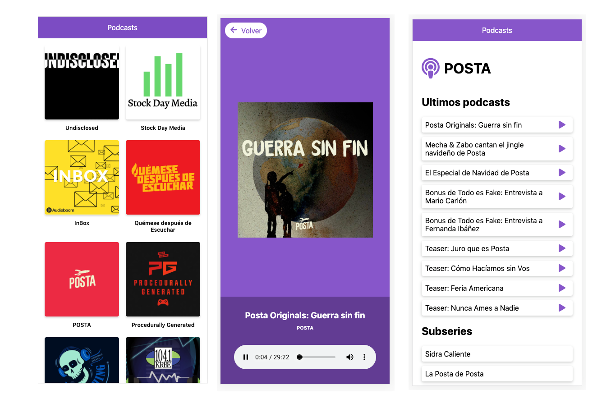

<h1 align="center">Welcome to App de Podcast Platzi 👋</h1>
<p>
  
  <a href="https://twitter.com/juliorafre">
    
  </a>
</p>

> App de podcasts integrada con la API de AudioBoom para aprender Next.JS



## Install

Requiere Node.JS 10

```sh
npm install
```

## Usage dev

```sh
npm run dev
```

## Usage production

```sh
npm run build && npm start
```

## Author

👤 **Julio Andres Ramirez De Freitas**

-   Twitter: [@juliorafre](https://twitter.com/juliorafre)
-   Github: [@JulioAndresRamirez](https://github.com/JulioAndresRamirez)

## Show your support

Give a ⭐️ if this project helped you!

---

_This README was generated with ❤️ by [readme-md-generator](https://github.com/kefranabg/readme-md-generator)_
